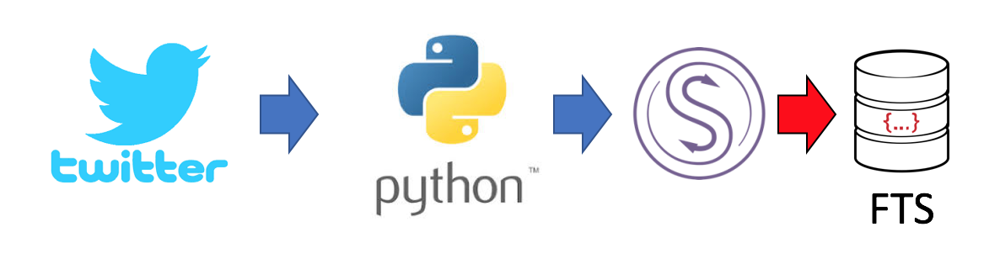

# couchbase-twitter-demo
Putting Tweets into Couchbase via Sync Gateway



http://www.tweepy.org/    source: https://github.com/tweepy/tweepy

This is a simple demo for getting tweets into Couchbase via Sync Gateway

1. Download the above tweepy repo to your local machine from above link.


2. Download and install sg-streaming.py(above) into the "examples" folder in tweepy download.


3. Insert your twitter keys & tokens in the sg-streaming.py
```
-# Go to http://apps.twitter.com and create an app.
-# The consumer key and secret will be generated for you after
consumer_key="..."
consumer_secret="..."

-# After the step above, you will be redirected to your app's page.
-# Create an access token under the the "Your access token" section
access_token="..."
access_token_secret="..."
```


4.a Create a Bucket in Couchbase 

4.b Create a user with password for sync gateway.


5.a Download above Sync Gateway config file "basic-couchbase-bucket-twitter.json"

5.b Update config file with bucket name and username & password and start Sync Gateway with config file.
```
# bin/sync_gateway /path/to/config/file/basic-couchbase-bucket-twitter.json
```


#Requirements

- Python 2.7.x
