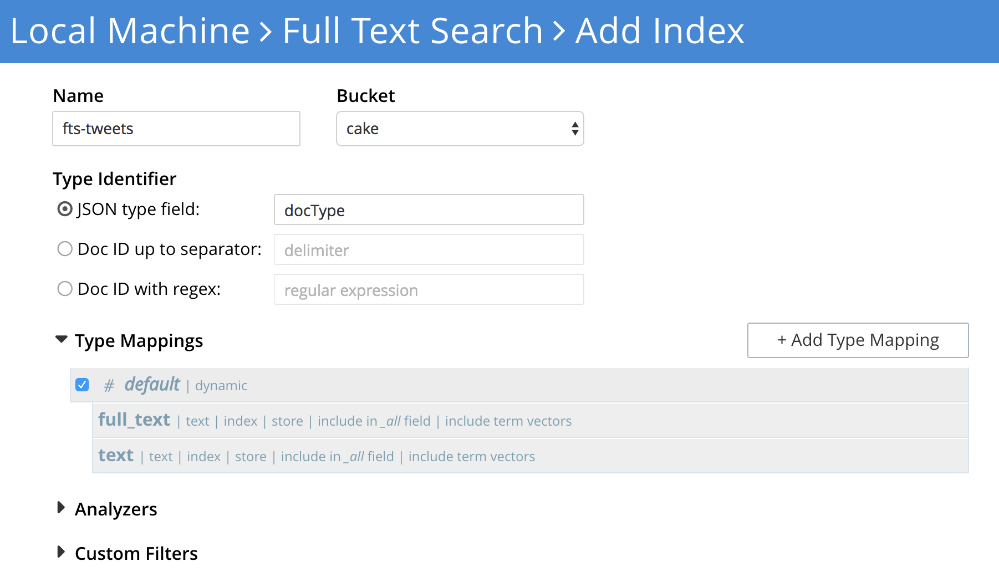

# couchbase-twitter-demo
Putting Tweets into Couchbase via Sync Gateway


http://www.tweepy.org/    source: https://github.com/tweepy/tweepy

This is a simple demo for getting tweets into Couchbase via Sync Gateway

1. Download the above tweepy repo to your local machine from (ABOVE) link.


2. Download and copy the sg-streaming.py (ABOVE) into the "examples" folder in tweepy download.


3. Insert your twitter keys & tokens in the sg-streaming.py
```
-# Go to http://apps.twitter.com and create an app.
-# The consumer key and secret will be generated for you after
consumer_key="..."
consumer_secret="..."

-# After the step above, you will be redirected to your app's page.
-# Create an access token under the the "Your access token" section
access_token="..."
access_token_secret="..."
```


4.a Create a Bucket in Couchbase (OPTIONAL create the bucket with FULL EJECTION) 

4.b Create a user in Couchbase with password so sync gateway can access the bucket (FULL ADMIN user is the faster and easiest).


5.a Download (ABOVE) Sync Gateway config file "basic-couchbase-bucket-twitter.json"

5.b Update the config file with the bucket name , username and password. Then go to the folder that you downloaded Sync Gateway and start it with the config (BELOW).

```
# bin/sync_gateway /path/to/config/file/basic-couchbase-bucket-twitter.json
```


6a. Currently the twitter feed is filtered by "basketball" related tweets. You might want to change it to something more interesting to you. To change it just open sg-streaming.py and on the last line in the file and change the filter string (BELOW).
```
stream.filter(track=['basketball'],async=True)
```


6b. Start the python script to get tweets and insert them into Sync Gateway
```
# ./sg-streaming.py
```


# FTS
Below is an example of a Full Text Search Index on the tweets in Couchbase.



# Requirements

- Python 2.7.x
